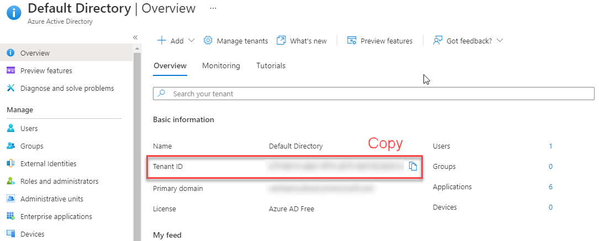
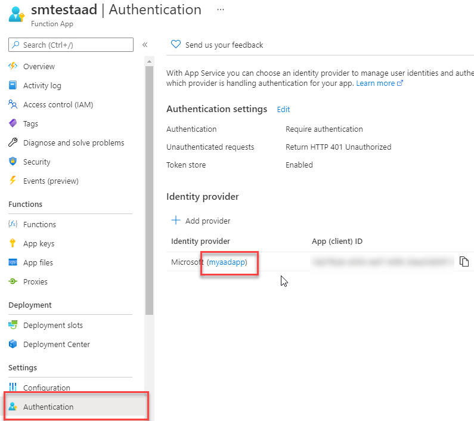
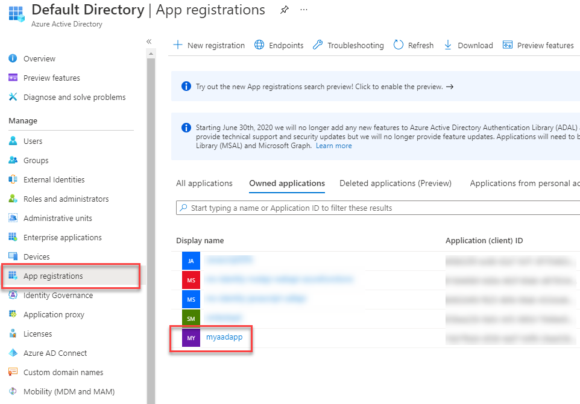
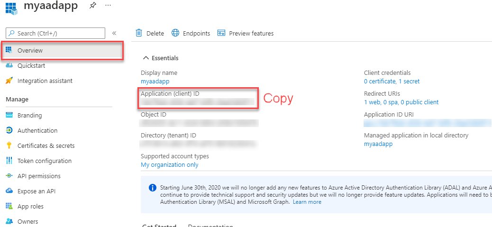
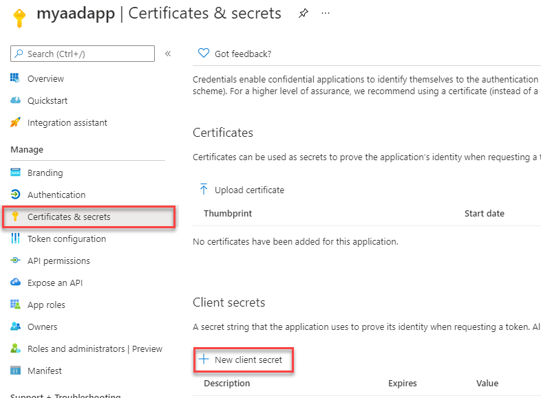
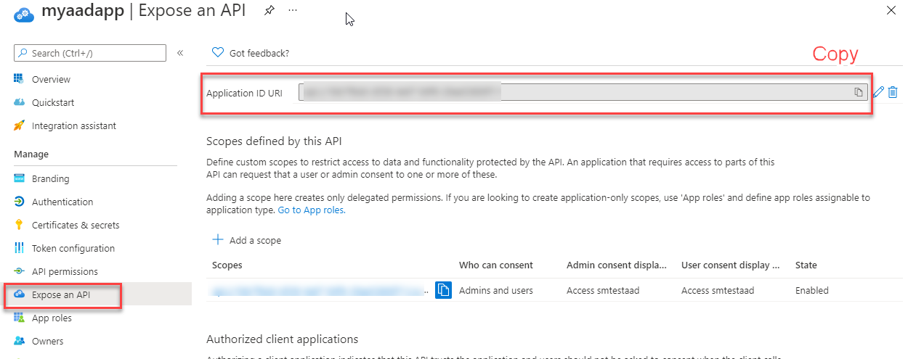
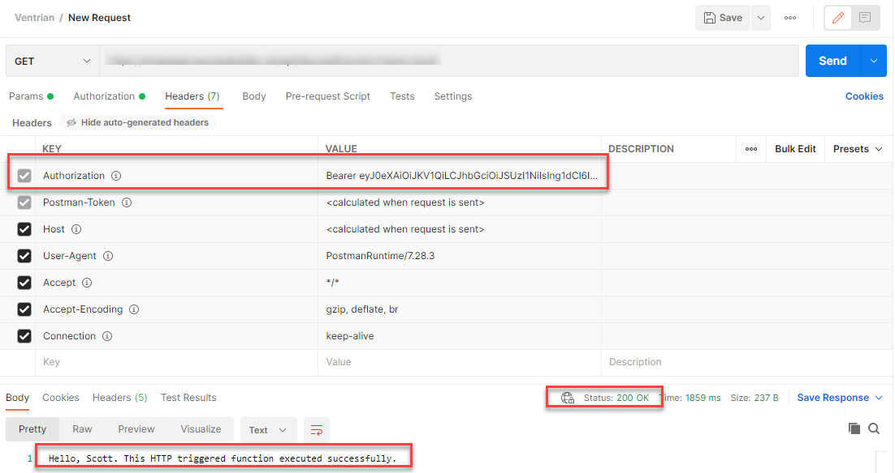

Once you have protected an Azure Function using AAD (Azure Active Directory), these instructions allow you to securely call it from another process (e.g. Console App, Azure Function, etc).

To successfully call an Azure AD protected function using [client credentials flow](https://docs.microsoft.com/en-us/azure/active-directory/azuread-dev/v1-oauth2-client-creds-grant-flow), you'll need 4 things:

- Tenant ID
- Application ID
- Client Secret
- Application ID Url

## Step 1: Tenant ID

To retrieve the tenant ID, navigate to **Azure Active Directory**. Record down the **Tenant ID** for future use.



## Step 2: Retrieve Application ID

Next, navigate to your Azure Function that has been secured and look at the **Authentication** blade to retrieve the **Application Name**.

In the below screenshot, the application name is **myaadapp**. Record down your application name for future use.



Navigate to **Azure Active Directory** -> **App Registrations** and click on the application name you just recorded.



In the application overview, take note of the **Application ID** (you'll use it later).



## Step 3: Create Client Secret

While still in the application from step 2, navigate to **Certificates & secrets**. Click **New client secret**, specify description (optional) and an expiry.



Record down the generated secret for future use.


> Note: these secrets will expire and will need to be regularly renewed.

## Step 4: Get Application ID Url

While still in the application from step 2, navigate to **Expose an API**. Copy the **Application ID URI** and record it for future use.



## Step 5: Call Azure AD to retrieve access token

In the application you have built (e.g. Console App, Azure Function, etc). You need to call **Azure Active Directory** to retrieve an **Access Token**.

Use the settings you recorded in previous steps to populate the call below.

```
POST /<your tenant id>/oauth2/token HTTP/1.1
Host: login.microsoftonline.com
Content-Type: application/x-www-form-urlencoded

grant_type=client_credentials
&client_id=<your application id>
&client_secret=<your client secret>
&resource=<your application id url>
```

## Step 6: Call Azure Function

Once you have your token, attached the "Authorization" header with a value of:

```
Bearer <access token>
```

For example:


